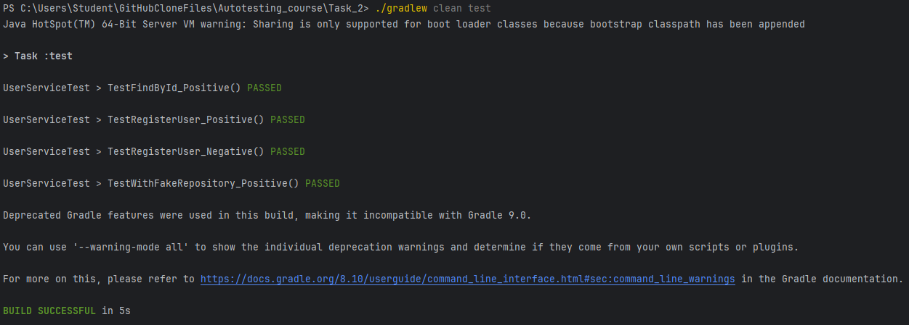

## MOCK  
За допомогою анотації `@Mock`:
```java
@Mock
private UserRepository mockedRepository;
```  
В такому випадку створюється Проксі-Мок-Об'єкт з яким можна працювати через `verify`
```java
verify(mockedRepository,times(1)).findById(1L); // Перевірить що об'єкт виконав 1 операцію findById(1L)
// Дефолтне значення times(1), можна вказувати і більше число, або never() те саме що і times(0)
```

## STUB
stub - заглушка
реалізується за допомогою методів `when().then()`
```java
when(mockedRepository.findById(1L)).thenReturn(Optional.of(expectedUser)); 
// Створює поведінку для методу findById(1L) на випадок коли аргумент = 1L 
// Також можна передбачити кидання виняткової ситуації використавши thenThrow(() ->new Exception("..."))
```

## FAKE
Цей спосіб передбачає наповнення об'єкта пропустивши цілу ланку залежностей
Наприклад, щоб отримати дані в репозиторій нам потрібно написати логіку вичитування і перенесення і зберігання. А використовуючи fake ми створюємо мінімальну, потрібну нам реалізацію
```java
UserRepository fakeRepository = new UserRepository() {
            private final Map<Long, User> db = new HashMap<>();
            private Long idCounter = 1L;

            @Override
            public Optional<User> findById(Long id) {
                return Optional.of(db.get(id));
            }

            @Override
            public User saveUser(User user) {
                User savedUser = new User(idCounter++, user.name(), user.password());
                db.put(savedUser.id(), savedUser);
                return savedUser;
            }
        };
```
А далі тестуємо необхідний нам функціонал
```java
UserService userServiceWithFakeRepository = new UserService(fakeRepository);
        String name = "Abigail";
        String password = "LegalPassword";
        User createdUser = userServiceWithFakeRepository.registerUser(name, password);

        assertEquals(1L, createdUser.id());
        assertEquals(name, createdUser.name());
        assertEquals(password, createdUser.password());
```