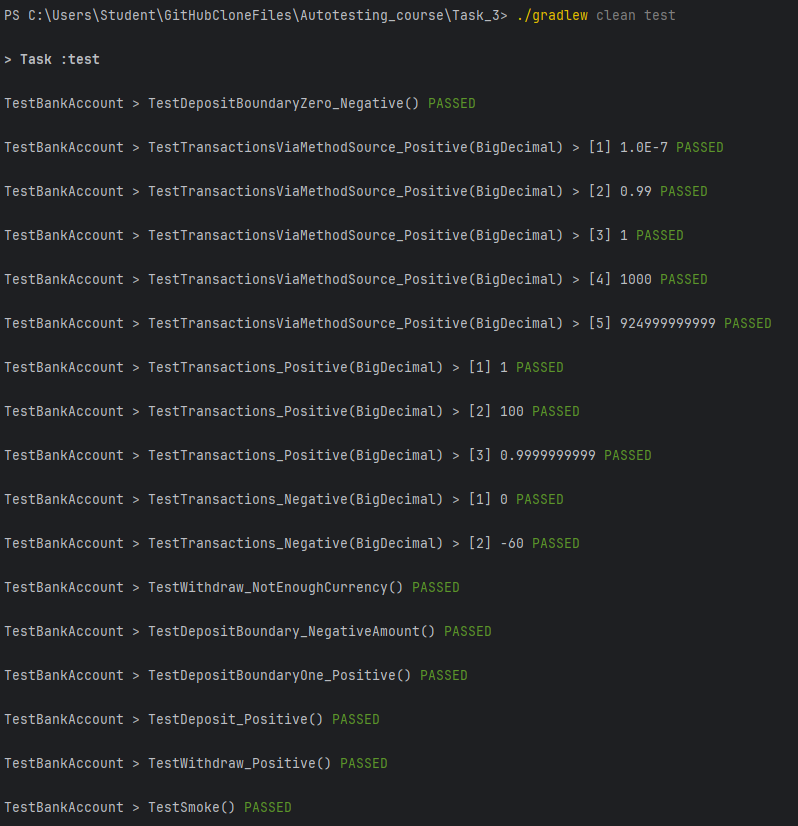

TC-01 (Positive): Успішна ініціалізація об'єкта BankAccount.

TC-02 (Positive): Поповнення балансу на додатне значення (1000).

TC-03 (Positive): Зняття коштів за наявності достатнього балансу (500).

TC-04 (Boundary/Positive): Поповнення на мінімальне додатне ціле значення (1).

TC-05 (Boundary/Negative): Поповнення на нульову суму (0) — очікується IllegalAmountException.

TC-06 (Negative): Поповнення на від'ємне значення (-19) — очікується IllegalAmountException.

TC-07 (Negative): Зняття суми, що перевищує поточний баланс — очікується IllegalAmountException.

TC-08 (Parameterized/Positive): Поповнення та зняття валідних сум зі строкових значень (1, 100, 0.9999999999).

TC-09 (Parameterized/Negative): Спроба транзакції з нульовим та від'ємним значеннями (0, -60).

TC-10 (Parameterized/Boundary): Перевірка граничних і великих сум через MethodSource (0.0000001, 0.99, 1, 1000,
924999999999).